# Sơ đồ Luồng Nghiệp vụ - Hệ thống Bán Vé Tàu Điện

## Use Case Diagram - Tổng quan Hệ thống

```mermaid
graph TB
    subgraph "Actors"
        Customer[👤 Khách hàng<br/>Customer]
        Inspector[👮 Nhân viên soát vé<br/>Inspector]
        Admin[👨‍💼 Quản trị viên<br/>Admin]
    end
    
    subgraph "Hệ thống Bán Vé Tàu Điện"
        subgraph "Quản lý Tài khoản"
            UC1[Đăng ký tài khoản]
            UC2[Đăng nhập]
            UC3[Đăng xuất]
            UC4[Cập nhật thông tin]
        end
        
        subgraph "Tìm kiếm & Đặt vé"
            UC5[Tìm kiếm chuyến tàu]
            UC6[Xem chi tiết chuyến]
            UC7[Chọn ghế]
            UC8[Áp dụng voucher]
            UC9[Thanh toán]
            UC10[Nhận vé điện tử]
        end
        
        subgraph "Quản lý Vé"
            UC11[Xem lịch sử đặt vé]
            UC12[Xem chi tiết vé]
            UC13[Hủy vé]
        end
        
        subgraph "Kiểm tra Vé"
            UC14[Quét QR code]
            UC15[Xác thực vé]
            UC16[Đánh dấu vé đã sử dụng]
        end
        
        subgraph "Quản lý Hệ thống"
            UC17[Quản lý tuyến tàu]
            UC18[Quản lý chuyến tàu]
            UC19[Cấu hình giá vé]
            UC20[Quản lý voucher]
            UC21[Duyệt hoàn tiền]
            UC22[Xem báo cáo]
        end
    end
    
    Customer --> UC1
    Customer --> UC2
    Customer --> UC3
    Customer --> UC4
    Customer --> UC5
    Customer --> UC6
    Customer --> UC7
    Customer --> UC8
    Customer --> UC9
    Customer --> UC10
    Customer --> UC11
    Customer --> UC12
    Customer --> UC13
    
    Inspector --> UC2
    Inspector --> UC3
    Inspector --> UC14
    Inspector --> UC15
    Inspector --> UC16
    
    Admin --> UC2
    Admin --> UC3
    Admin --> UC17
    Admin --> UC18
    Admin --> UC19
    Admin --> UC20
    Admin --> UC21
    Admin --> UC22
    
    style Customer fill:#e1f5ff
    style Inspector fill:#fff4e1
    style Admin fill:#ffe1e1
```

## Luồng 1: Đăng ký và Đăng nhập

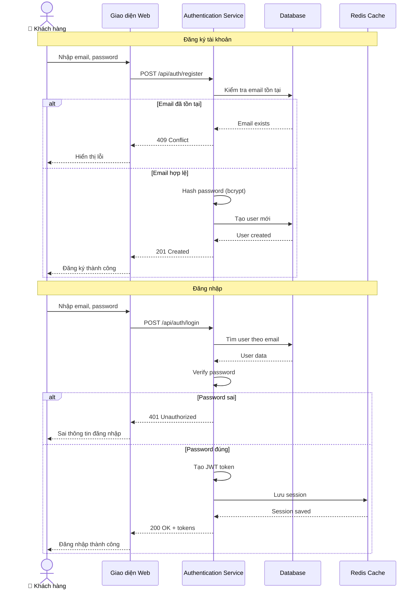

## Luồng 2: Tìm kiếm và Đặt vé

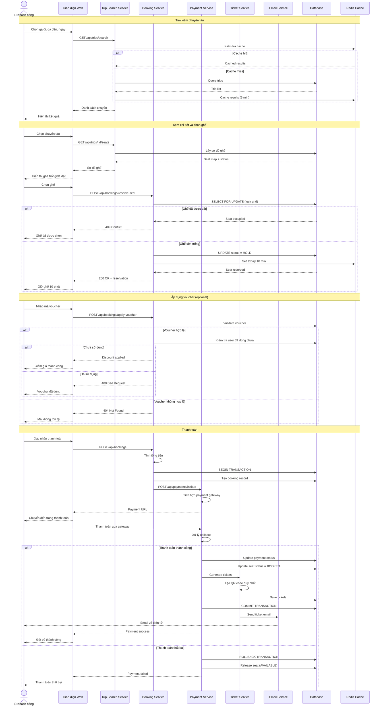

## Luồng 3: Quản lý Vé của Khách hàng

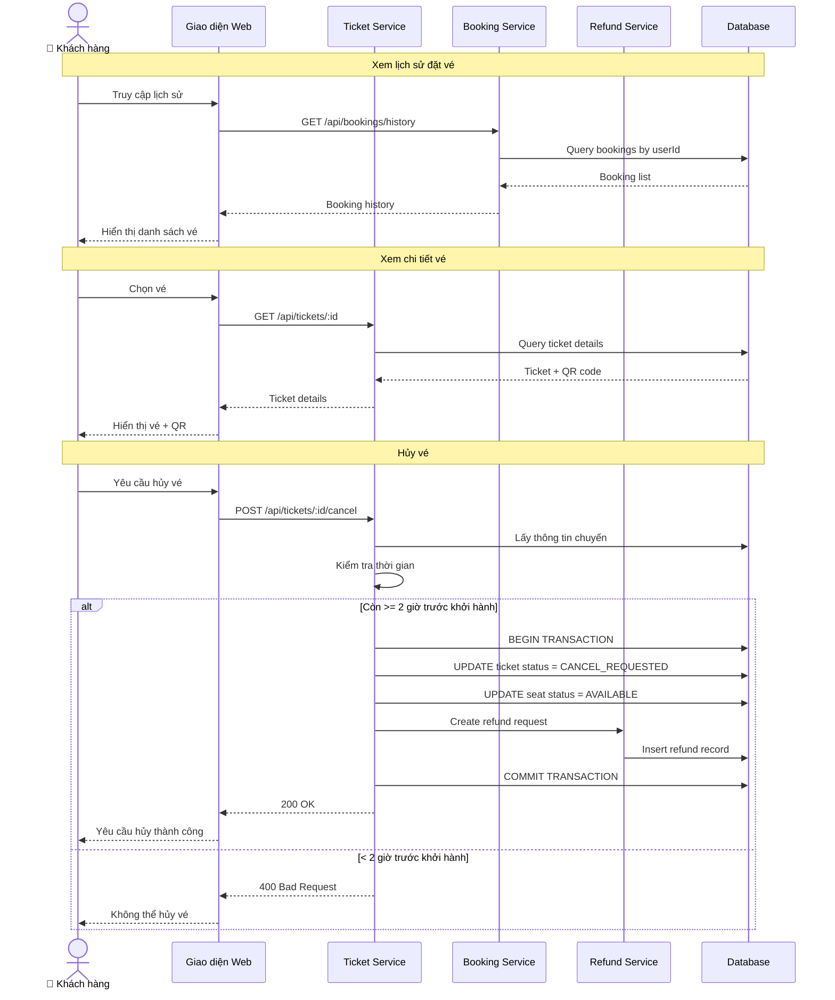

## Luồng 4: Kiểm tra Vé (Inspector)

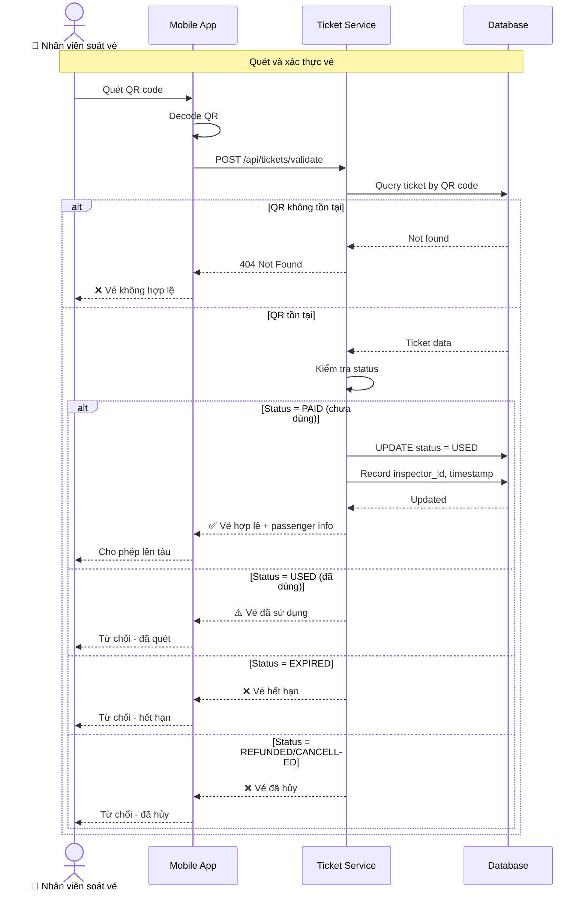

## Luồng 5: Quản lý Tuyến và Chuyến (Admin)

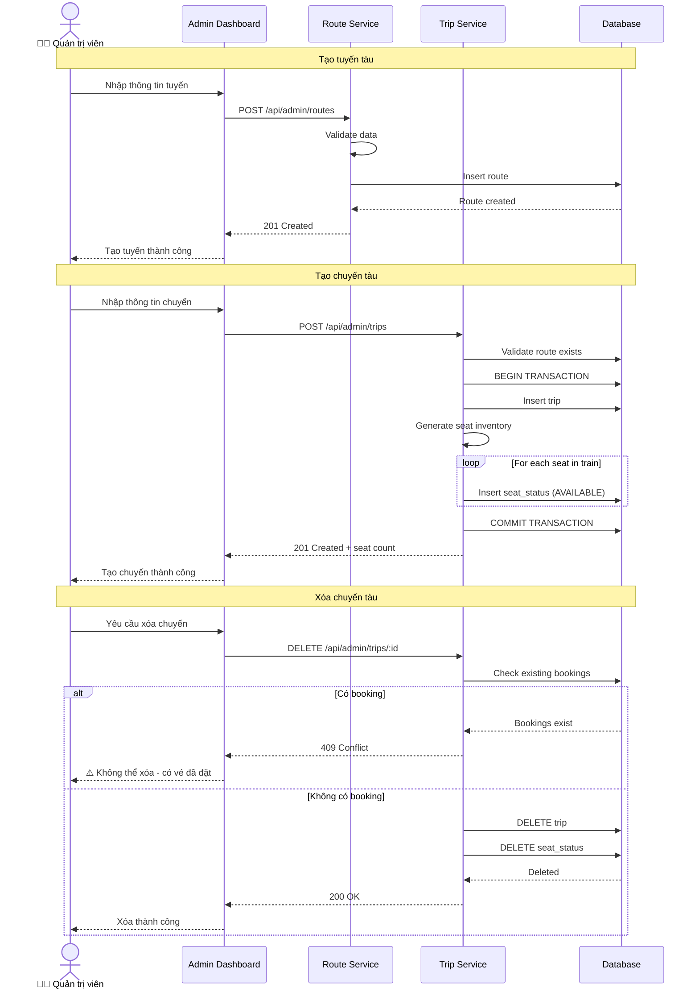

## Luồng 6: Quản lý Voucher và Giá (Admin)

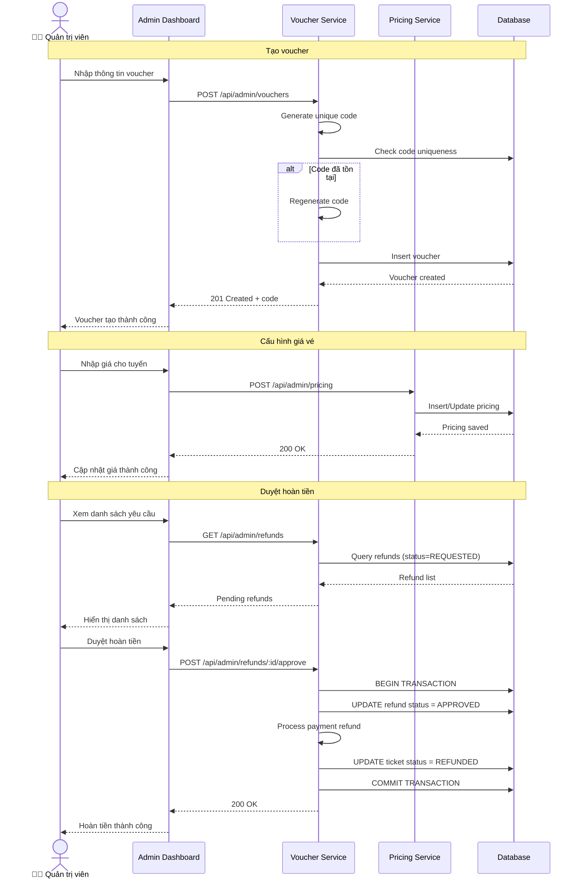

## Luồng 7: Báo cáo và Thống kê (Admin)

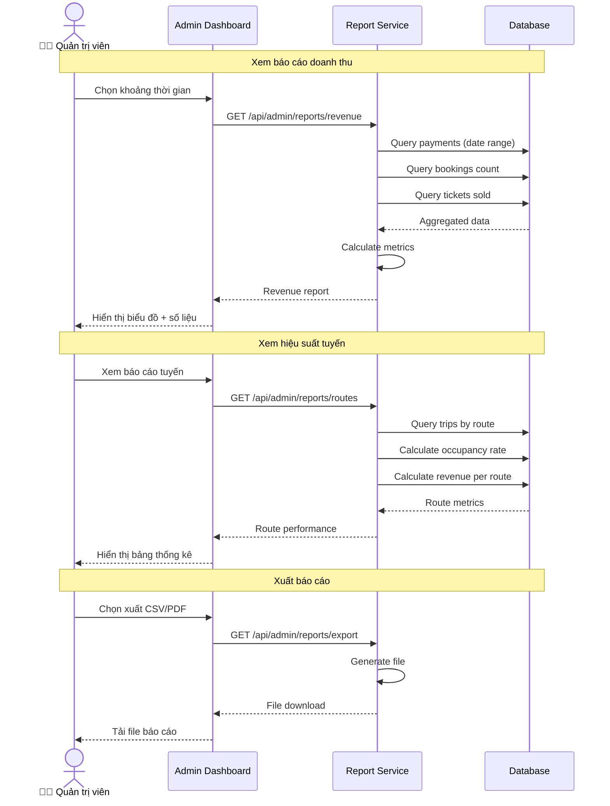

## Luồng 8: Xử lý Concurrent Booking

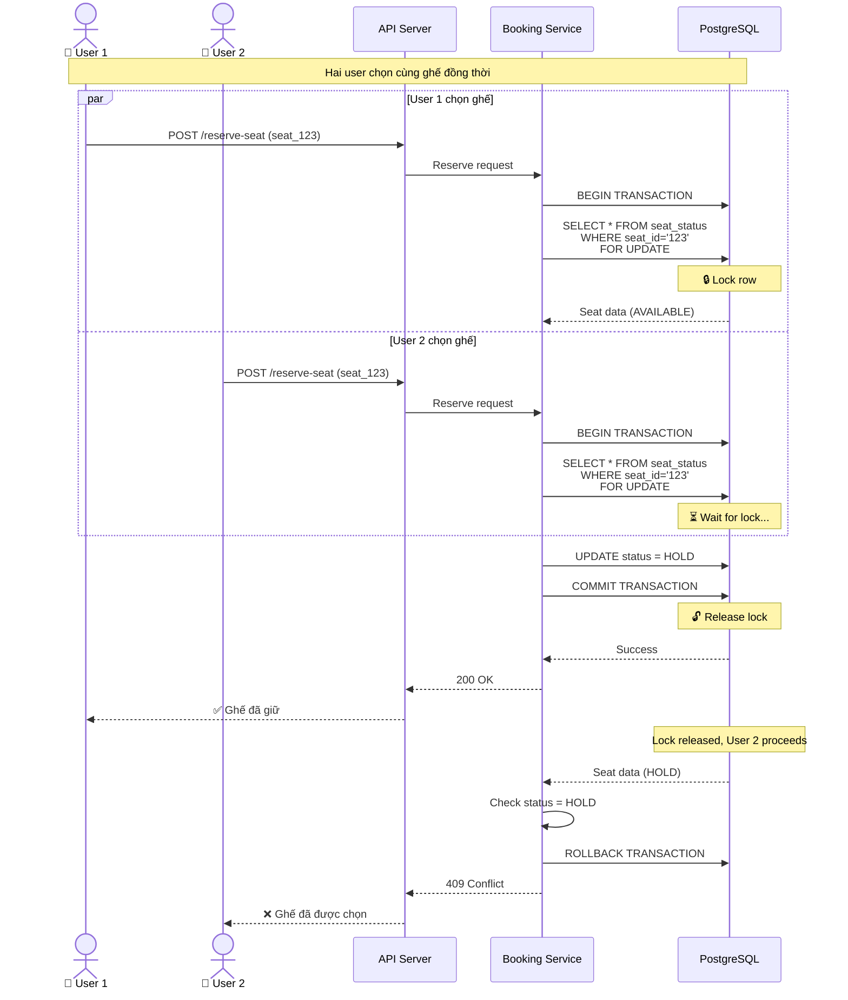

## Luồng 9: Tự động Hết hạn Giữ Ghế

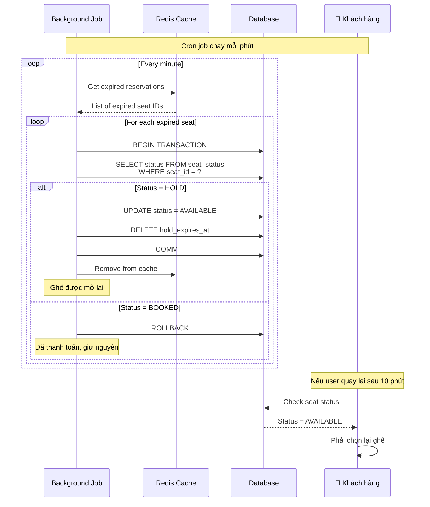

## Sơ đồ Trạng thái Vé (Ticket State Machine)

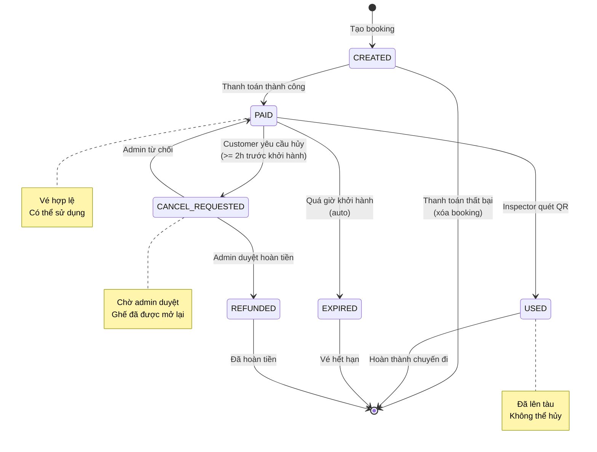

## Sơ đồ Trạng thái Ghế (Seat State Machine)

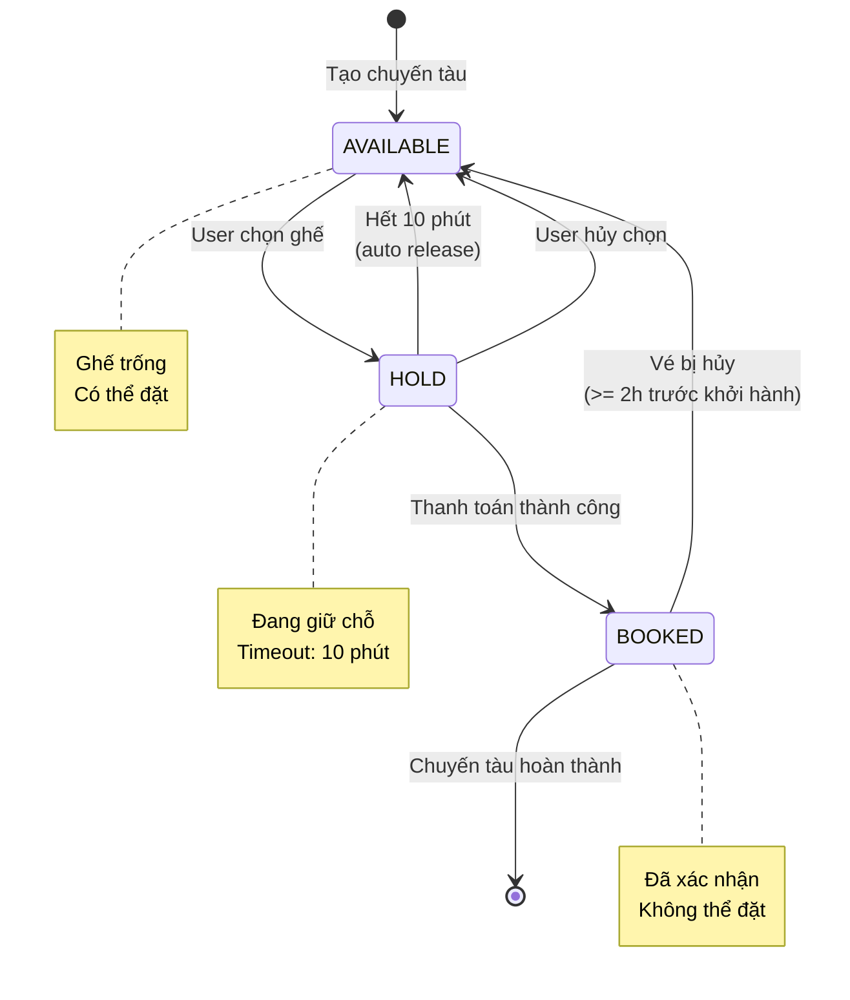

## Công thức Tính Giá

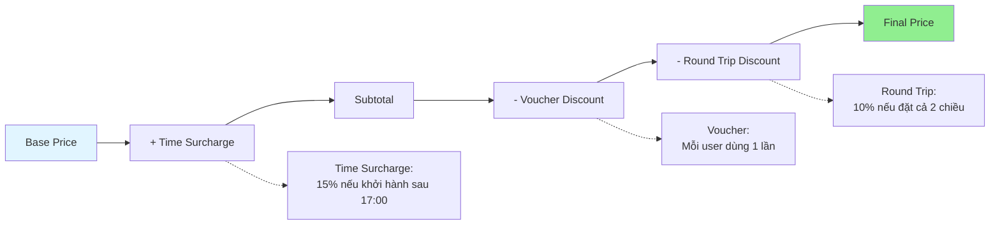

