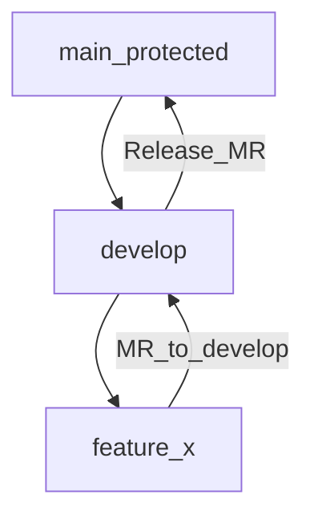

# BaiTap3 - Git Flow (GitLab) + Merge Request + Code Review

## 1) Mục tiêu

- Làm việc nhóm theo **Git Flow** với nhánh chính là **`main`** trên **GitLab**
- Thực hành **tạo Merge Request (MR)**, **review code**, phản hồi và cải tiến chất lượng code
- Xây dựng 1 web app nhỏ bằng **HTML/CSS/JS** theo hướng chia nhỏ tính năng: mỗi tính năng = 1 nhánh `feature/*` + 1 MR

---

## 2) Yêu cầu chung

- **Không push trực tiếp lên `main`** (branch `main` phải được bảo vệ/protected)
- Mỗi thay đổi phải đi qua:
  - tạo nhánh → commit → push → tạo MR → review → sửa theo review → merge
- Tối thiểu:
  - **mỗi thành viên tạo ≥ 2 MR**
  - **mỗi thành viên review ≥ 2 MR của người khác**
- Mỗi MR phải có:
  - **mô tả rõ ràng**, link Issue (nếu có), ảnh/clip demo (nếu UI)
  - ít nhất **1 reviewer**

---

## 3) Chuẩn repo & cấu trúc bài làm

Tạo thư mục dự án:

```
web-app/
  index.html
  styles.css
  app.js
  README.md
```

Quy ước:
- Code **thuần HTML/CSS/JS** (không framework) để tập trung Git Flow + review
- Code dễ đọc: tên biến rõ ràng, tách hàm, tránh “code 1 cục”

---

## 4) Git Flow cho bài này (nhánh chính là `main`)

### 4.1 Nhánh và quy ước đặt tên

- **`main`**: nhánh chính, luôn ổn định, chỉ nhận code qua MR
- **`develop`** (khuyến nghị): nhánh tích hợp, nhận MR từ các `feature/*`
- **`feature/<ten-chuc-nang>`**: mỗi tính năng một nhánh (VD: `feature/add-student`)
- **`hotfix/<ten-sua-loi>`**: sửa lỗi khẩn cấp (nếu cần)

Nếu lớp/nhóm muốn đơn giản hơn, có thể bỏ `develop` và MR trực tiếp về `main`.
Tuy nhiên **ưu tiên dùng `develop`** để mô phỏng Git Flow đúng nghĩa và giảm rủi ro lên `main`.

### 4.2 Sơ đồ luồng làm việc



---

## 5) Trên GitLab

### 5.1 Tạo project và mời thành viên

- 1 bạn làm **Maintainer/Owner** tạo project GitLab
- Mời các bạn còn lại vào project với role:
  - **Developer** (thành viên còn lại)

### 5.2 Bảo vệ nhánh `main`

Trong GitLab:
- Settings → Repository → Protected branches
- Protect `main`:
  - **No one** được push trực tiếp (hoặc chỉ Maintainer)
  - **Merge chỉ qua MR**, bật yêu cầu approval nếu có

Khuyến nghị bật thêm:
- Require approval (≥ 1)
- Squash commits khi merge (tuỳ nhóm)
- Delete source branch sau merge

---

## 6) Bộ lệnh Git tối thiểu (tham khảo từ cheat sheet)

### 6.1 Setup (mỗi máy 1 lần)

```bash
git config --global user.name "Firstname Lastname"
git config --global user.email "valid-email@example.com"
```

### 6.2 Clone repo

```bash
git clone <gitlab-repo-url>
```

### 6.3 Làm việc với nhánh

```bash
git branch
git checkout -b feature/<ten-chuc-nang>
```

### 6.4 Stage / commit

```bash
git status
git add .
git diff
git commit -m "feat: <mo-ta-ngan>"
```

### 6.5 Đồng bộ và đẩy code lên GitLab

```bash
git pull
git push -u origin feature/<ten-chuc-nang>
```

### 6.6 Xem log

```bash
git log
```

Gợi ý khi cần:
- `git diff --staged` để xem phần đã stage
- `git stash` khi cần đổi nhánh mà chưa muốn commit

---

## 7) Quy trình bắt buộc cho mỗi tính năng

### 7.1 Tạo Issue

Trên GitLab → Issues:
- Tạo Issue cho tính năng (VD: “Add student form”)
- Gắn label: `feature`, `bug`, `ui`, ...

### 7.2 Tạo nhánh feature từ `develop`

1) Cập nhật local:
- checkout `develop`
- pull mới nhất

2) Tạo nhánh:
- `feature/<ten-chuc-nang>`

### 7.3 Code + commit nhỏ, rõ ràng

Mỗi commit nên:
- tập trung 1 ý
- message rõ ràng, ưu tiên dạng:
  - `feat: ...`
  - `fix: ...`
  - `docs: ...`
  - `refactor: ...`

### 7.4 Push và tạo Merge Request (MR)

Tạo MR:
- Source: `feature/...`
- Target: `develop` (hoặc `main` nếu không dùng develop)

MR phải có:
- **Summary**: bạn làm gì, tại sao
- **Screenshots** (nếu UI)
- **Test plan**: các bước test

### 7.5 Review code BẮT BUỘC

Reviewer cần kiểm tra:
- Code chạy được, không lỗi console
- UI đúng yêu cầu
- Dễ đọc, đặt tên hợp lý
- Không duplicate code (cố gắng tách hàm)
- Không commit file rác (node_modules, .env, ...)

Người tạo MR:
- trả lời comment lịch sự, sửa theo góp ý
- push thêm commit (hoặc squash tuỳ nhóm)
- chỉ merge khi đạt yêu cầu review

---

## 8) Bài tập cho cả team: “Student Management Dashboard”

### 8.1 Mô tả

Làm 1 trang web quản lý sinh viên chạy trên trình duyệt (không cần backend), dữ liệu lưu tạm trong mảng JS và **localStorage**.

### 8.2 Danh sách chức năng

Mỗi chức năng = 1 Issue + 1 nhánh `feature/*` + 1 MR.

| STT | Chức năng | Mô tả ngắn |
|---:|---|---|
| 01 | Layout cơ bản | Header + main + footer, responsive |
| 02 | Hiển thị danh sách | Render bảng sinh viên từ mảng JS |
| 03 | Thêm sinh viên | Form + validate + add + lưu localStorage |
| 04 | Tìm kiếm | Tìm theo mã/tên/lớp |
| 05 | Dark/Light mode | Toggle theme + lưu localStorage |

Gợi ý chia việc:
- 1 bạn làm “Layout + bảng danh sách”
- 1 bạn làm “Add + validate + lưu localStorage”
- 1 bạn làm “Search”
- 1 bạn làm “Theme (dark/light)”

---

## 9) Code mẫu tham khảo

### 9.1 Mẫu `index.html` (layout + hook cho JS)

```html
<!doctype html>
<html lang="vi">
  <head>
    <meta charset="utf-8" />
    <meta name="viewport" content="width=device-width, initial-scale=1" />
    <title>Student Management Dashboard</title>
    <link rel="stylesheet" href="styles.css" />
  </head>
  <body>
    <header class="topbar">
      <h1>Student Dashboard</h1>
      <button id="themeToggle" type="button" class="btn">Toggle theme</button>
    </header>

    <main class="container">
      <section class="card">
        <h2>Thêm sinh viên</h2>
        <form id="studentForm" class="grid" autocomplete="off">
          <label>
            Mã SV
            <input id="studentId" required placeholder="VD: SV001" />
          </label>
          <label>
            Họ tên
            <input id="studentName" required placeholder="VD: Nguyen Van A" />
          </label>
          <label>
            Lớp
            <input id="studentClass" required placeholder="VD: D21CQCN01" />
          </label>
          <label>
            Điểm (0-10)
            <input id="studentScore" type="number" min="0" max="10" step="0.1" required />
          </label>
          <div class="row">
            <button class="btn primary" type="submit">Add</button>
            <button class="btn" type="reset">Reset</button>
          </div>
          <p id="formError" class="error" aria-live="polite"></p>
        </form>
      </section>

      <section class="card">
        <h2>Danh sách sinh viên</h2>
        <div class="row">
          <input id="searchInput" placeholder="Tìm theo mã/tên/lớp..." />
          <button id="clearSearch" class="btn" type="button">Clear</button>
        </div>
        <div class="tableWrap">
          <table class="table" id="studentTable">
            <thead>
              <tr>
                <th>Mã</th>
                <th>Họ tên</th>
                <th>Lớp</th>
                <th>Điểm</th>
              </tr>
            </thead>
            <tbody id="studentTbody"></tbody>
          </table>
        </div>
      </section>
    </main>

    <footer class="footer">CC_T2 - BaiTap3</footer>
    <script src="app.js"></script>
  </body>
</html>
```

### 9.2 Mẫu `styles.css` (UI đơn giản + dark/light)

```css
:root {
  --bg: #0b1220;
  --card: #111a2e;
  --text: #e6eaf2;
  --muted: #9aa6bf;
  --line: rgba(255, 255, 255, 0.12);
  --primary: #4f8cff;
}

[data-theme="light"] {
  --bg: #f6f7fb;
  --card: #ffffff;
  --text: #121826;
  --muted: #5f6b7a;
  --line: rgba(18, 24, 38, 0.12);
  --primary: #2563eb;
}

* { box-sizing: border-box; }
body {
  margin: 0;
  font-family: system-ui, -apple-system, Segoe UI, Roboto, Arial, sans-serif;
  background: var(--bg);
  color: var(--text);
}

.topbar {
  display: flex;
  align-items: center;
  justify-content: space-between;
  gap: 12px;
  padding: 14px 18px;
  border-bottom: 1px solid var(--line);
  position: sticky;
  top: 0;
  background: color-mix(in srgb, var(--bg) 90%, transparent);
  backdrop-filter: blur(8px);
}

.container {
  max-width: 980px;
  margin: 18px auto;
  padding: 0 16px 24px;
  display: grid;
  gap: 16px;
}

.card {
  background: var(--card);
  border: 1px solid var(--line);
  border-radius: 14px;
  padding: 16px;
}

.grid {
  display: grid;
  grid-template-columns: repeat(2, minmax(0, 1fr));
  gap: 12px;
}
.grid label { display: grid; gap: 6px; color: var(--muted); }
.grid input {
  padding: 10px 12px;
  border-radius: 10px;
  border: 1px solid var(--line);
  background: transparent;
  color: var(--text);
  outline: none;
}

.row { display: flex; gap: 10px; align-items: center; flex-wrap: wrap; }

.btn {
  padding: 10px 12px;
  border-radius: 10px;
  border: 1px solid var(--line);
  background: transparent;
  color: var(--text);
  cursor: pointer;
}
.btn.primary {
  border-color: color-mix(in srgb, var(--primary) 55%, var(--line));
  background: color-mix(in srgb, var(--primary) 22%, transparent);
}

.error { margin: 6px 0 0; color: #ffb4b4; min-height: 1em; }

.tableWrap { overflow: auto; border-radius: 12px; border: 1px solid var(--line); }
.table { width: 100%; border-collapse: collapse; min-width: 640px; }
.table th, .table td { padding: 10px 12px; border-bottom: 1px solid var(--line); }
.table th { text-align: left; color: var(--muted); font-weight: 600; }

.footer {
  padding: 18px;
  text-align: center;
  color: var(--muted);
  border-top: 1px solid var(--line);
}

@media (max-width: 720px) {
  .grid { grid-template-columns: 1fr; }
}
```

### 9.3 Mẫu `app.js` (thêm SV + search + toggle theme)

```javascript
const STORAGE_KEY = "students_v1";
const THEME_KEY = "theme_v1";

const $ = (id) => document.getElementById(id);

let students = loadStudents();

function loadStudents() {
  try {
    return JSON.parse(localStorage.getItem(STORAGE_KEY)) ?? [];
  } catch {
    return [];
  }
}

function saveStudents() {
  localStorage.setItem(STORAGE_KEY, JSON.stringify(students));
}

function normalize(s) {
  return String(s ?? "").trim().toLowerCase();
}

function validateStudent(st) {
  if (!st.id || !st.name || !st.className) return "Vui lòng nhập đủ Mã SV, Họ tên, Lớp.";
  if (Number.isNaN(st.score) || st.score < 0 || st.score > 10) return "Điểm phải nằm trong [0, 10].";
  if (students.some((x) => x.id === st.id)) return "Mã SV đã tồn tại.";
  return "";
}

function render(list = students) {
  const tbody = $("studentTbody");
  tbody.innerHTML = "";
  for (const st of list) {
    const tr = document.createElement("tr");
    tr.innerHTML = `
      <td>${st.id}</td>
      <td>${st.name}</td>
      <td>${st.className}</td>
      <td>${st.score.toFixed(1)}</td>
    `;
    tbody.appendChild(tr);
  }
}

function setupAddForm() {
  const form = $("studentForm");
  const errorEl = $("formError");

  form.addEventListener("submit", (e) => {
    e.preventDefault();
    errorEl.textContent = "";

    const st = {
      id: normalize($("studentId").value).toUpperCase(),
      name: $("studentName").value.trim(),
      className: $("studentClass").value.trim(),
      score: Number($("studentScore").value),
      createdAt: Date.now(),
    };

    const err = validateStudent(st);
    if (err) {
      errorEl.textContent = err;
      return;
    }

    students.push(st);
    saveStudents();
    form.reset();
    render();
  });
}

function setupSearch() {
  const input = $("searchInput");
  const clear = $("clearSearch");

  function apply() {
    const q = normalize(input.value);
    if (!q) return render(students);
    const filtered = students.filter((s) => {
      return (
        normalize(s.id).includes(q) ||
        normalize(s.name).includes(q) ||
        normalize(s.className).includes(q)
      );
    });
    render(filtered);
  }

  input.addEventListener("input", apply);
  clear.addEventListener("click", () => {
    input.value = "";
    render(students);
  });
}

function applyTheme(theme) {
  if (theme === "light") document.documentElement.setAttribute("data-theme", "light");
  else document.documentElement.removeAttribute("data-theme");
}

function setupTheme() {
  const saved = localStorage.getItem(THEME_KEY) || "dark";
  applyTheme(saved);

  $("themeToggle").addEventListener("click", () => {
    const current = document.documentElement.getAttribute("data-theme") === "light" ? "light" : "dark";
    const next = current === "light" ? "dark" : "light";
    localStorage.setItem(THEME_KEY, next);
    applyTheme(next);
  });
}

setupAddForm();
setupSearch();
setupTheme();
render();
```

> Lưu ý: Đây chỉ là code mẫu để team tham khảo. Khi làm thật, mỗi chức năng phải được tách ra theo nhánh `feature/*` và đưa qua MR để review.

---

## 10) Checklist review (copy vào MR description)

- [ ] Chạy được trên trình duyệt, không lỗi console
- [ ] UI đúng yêu cầu, responsive cơ bản
- [ ] Không có file rác (ví dụ: `node_modules/`, file build, file cá nhân)
- [ ] Code rõ ràng, đặt tên tốt, hạn chế duplicate

---

## 11) Yêu cầu nộp bài

GitLab project + minh chứng trong gitlab:

- **Danh sách MR**: mỗi thành viên ≥ 2 MR
- **Lịch sử review**: mỗi thành viên ≥ 2 review (comment/approval)

Khuyến nghị nộp thêm:
- `README.md` mô tả dự án + cách chạy + phân công

---

## 12) Cách chấm

- **Quy trình Git Flow + MR** (40%): đúng nhánh, đúng MR, không push thẳng `main`
- **Review chất lượng** (30%): comment hợp lý, phản hồi, sửa theo góp ý
- **Tính năng & UI** (30%): đủ **5 chức năng**, chạy ổn, code sạch

